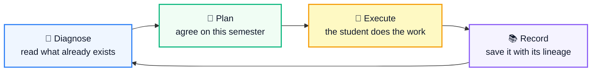

<div align="center">

# 세특연구소 API · Seteuk Lab Backend

**The API behind an AI coach that turns three years of scattered high‑school activity
notes into one coherent research narrative.**

[](https://fastapi.tiangolo.com)
[](https://python.org)
[](https://postgresql.org)
[](https://sqlalchemy.org)
[](https://deepseek.com)

<sub>The web frontend lives in a separate repository. Start there to see the product.</sub>

</div>

---

## What it does

Korean university admissions lean on the **학교생활기록부** (*school record*), and inside it
the **세부능력 및 특기사항** — the teacher‑written remarks about what a student actually did
in each subject. Over three years those entries pile up with no thread running through
them. This service keeps the thread.

It owns everything the product knows: parsing the school record PDF, running the
diagnosis, holding the consultation that produces a semester plan, storing records
across six domains, proposing follow‑up research, and streaming the chatbot.

## The loop it serves



Every activity can point at the activity it grew out of (`parent_activity_id`), and every
plan remembers the record it came from. That lineage is what lets the system propose
*"take last semester's limitation further"* instead of an unrelated new topic.

## What's inside

| Area | What it does |
|---|---|
| **School record parser** | Hybrid: rule‑based for tables (attendance, grades, awards, volunteering, reading), LLM for prose (subject remarks, creative activities). Records dated after the student's declared current semester are filtered out rather than silently stored. |
| **Diagnosis** | Four independently computed sections — grade trend (no LLM at all), per‑semester reviews, a career thread across activities, and a SWOT summary built only from the other sections' output. |
| **Consultation gate** | A student cannot reach plans, roadmaps, recommendations or general chat until a diagnosis and consultation are concluded — and concluding is an explicit endpoint call, never a side effect of a tool the chatbot ran. |
| **Plans & recommendations** | Suggestions are drafts. Adopting one turns it into a plan; completing a plan promotes it into a real record, inheriting the lineage. |
| **Chatbot** | SSE streaming with an edit mode whose 13 tools call the same services the tabs do. **There is no delete tool** — records can never disappear because of a misunderstanding in conversation. |

## Design rules

These hold across the codebase.

- **Propose, then confirm.** Onboarding suggestions store nothing. Parsing stops at
  `raw_result` and only what the student selects is imported. Roadmaps are drafts until
  `/confirm`.
- **The model is a translator, not an author.** Prompts get pre‑computed, scoped
  material and are asked to phrase it. Anything the data does not support is left out
  rather than smoothed over.
- **Prompts ask; code guarantees.** A reviewer filters duplicate suggestions, overlaps
  with existing plans, and claims about admissions or health — because responses that
  ignore those instructions were observed repeatedly in practice.
- **LLMs never handle UUIDs.** Batch calls hand the model integer indices and map them
  back, after a single dropped character in a UUID invalidated a whole batch.
- **Plans and records never share a table.** The future lives in `plan_items`, the past
  in the domain tables, and completion is the only bridge.

## Getting started

Requires **Python 3.12+**, [uv](https://github.com/astral-sh/uv), and PostgreSQL.

```bash
cp .env.example .env        # fill in DATABASE_URL, JWT_SECRET, DEEPSEEK_API_KEY
docker compose up -d db     # or point DATABASE_URL at your own PostgreSQL
uv sync
uv run alembic upgrade head
uv run uvicorn app.main:app --reload --port 8000
```

Interactive API docs: `http://127.0.0.1:8000/docs` · health: `/health`, `/health/ready`

```bash
ruff check .
pytest
alembic check               # models and migrations agree
```

### Configuration

Full list in `.env.example`. The ones that matter:

| Variable | Notes |
|---|---|
| `DATABASE_URL` | `postgresql+asyncpg://…` |
| `JWT_SECRET` | Required |
| `DEEPSEEK_API_KEY` | **Every** generation path uses DeepSeek — parser, diagnosis, plans, recommendations, chat |
| `CORS_ORIGINS` | Comma‑separated; the frontend always runs on a different origin |
| `DAILY_*_LIMIT` | Per‑user 24‑hour sliding window, counted in `usage_events` so it survives restarts and multiple workers |

## Layout

```
app/
  api/v1/      auth · profile · seteuk · diagnosis · records · plans ·
               roadmaps · recommendations · conversations · consultation
  services/    parser · diagnosis pipeline · chat (context, tools, prompts) ·
               plans · recommendations · review · llm provider boundary
  models/      SQLAlchemy models, one file per domain
  schemas/     Pydantic — reused for both API responses and LLM structured output
  core/        config · security · dependencies · rate limiting · logging
alembic/       migrations
docs/          API_SPEC.md · HANDOFF.md · PARSER_SPEC.md
```

`docs/HANDOFF.md` is the document to read first — how to run it, the boundaries to
respect, the current state, and the traps that cost the most time.

## Status

Working prototype, verified end‑to‑end with a real DeepSeek key and a real school record
PDF: sign‑up through parsing, diagnosis, consultation, records, follow‑up
recommendations, plan promotion, lineage and both chatbot modes. Not deployed publicly
yet.

Payments and subscriptions are intentionally out of scope.
